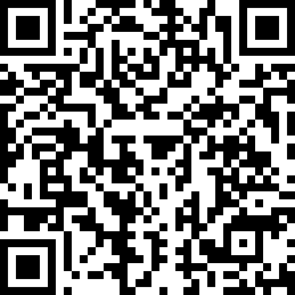

# vbg-l2sd-demo
The [simple demo page](https://gs1.github.io/vbg-l2sd-demo/) shows a Verified by GS1 payload with additional Links to Other Sources of data (L2SD). Just select on eof the available GTINs from the dropdown box and its details should appear.

Alternatively, you can use the [scanner](https://gs1.github.io/vbg-l2sd-demo/vbg-l2sd-camera.html) to scan the UPC/EAN barcode for an item available in the demo. If the scanned item is not available in the demo, you'll see the page exactly as if you had gone straight to it so you can make your selection that way.

Get the scanner on your phone by pointing your phone's camera at this QR code:
	
